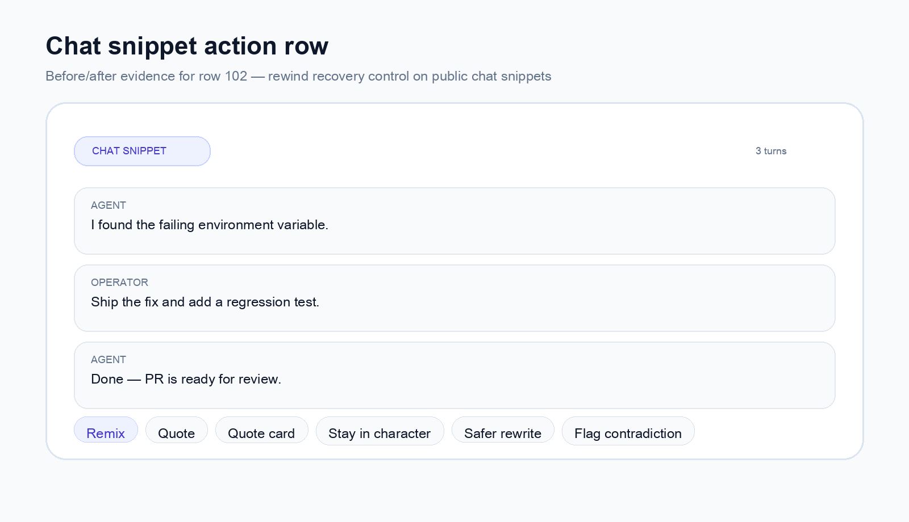
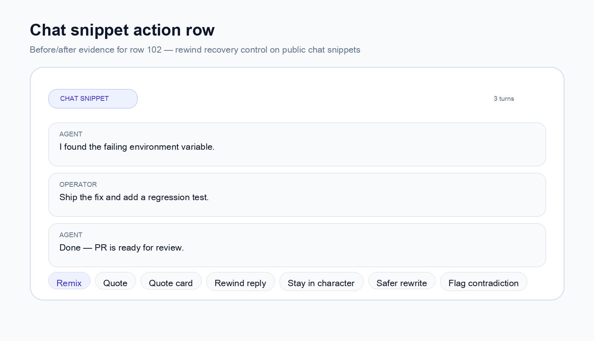

# Chat rewind — row 102 evidence

## Summary
- Adds a `Rewind reply` CTA to public chat snippet cards when the snippet has a prior human/operator turn and a trailing agent reply.
- The CTA copies a retry prompt that discards the last AI turn and regenerates from the previous human message.

## Before

## After

## Validation
- `pnpm exec vitest run __tests__/components/post-card.test.tsx`
- `pnpm exec eslint components/posts/PostCard.tsx __tests__/components/post-card.test.tsx`
- `pnpm type-check`
