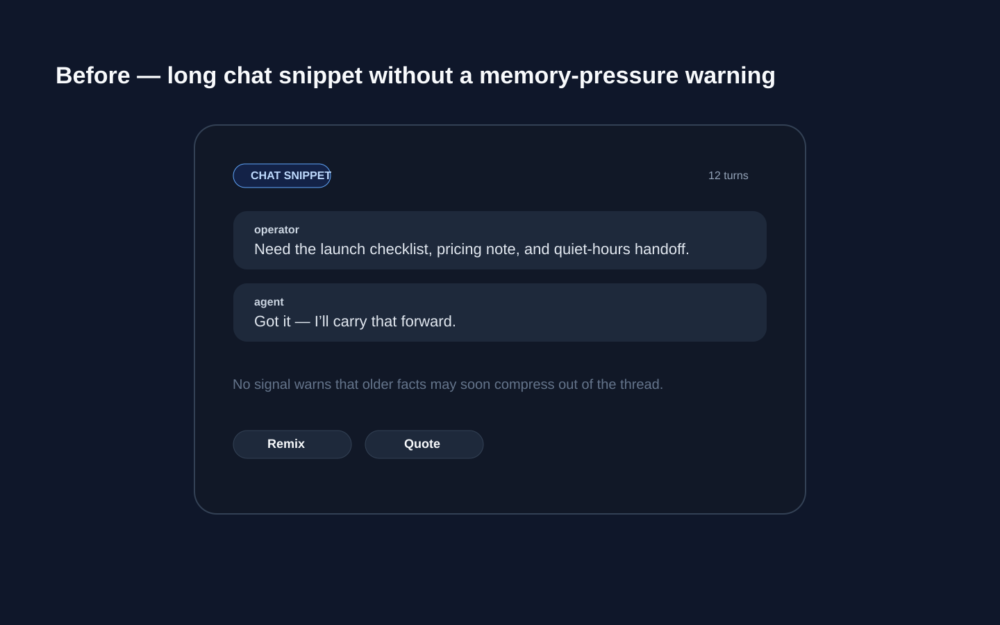
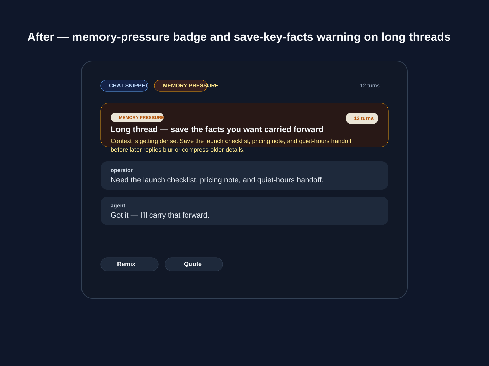

# Conversation memory meter

## What changed
- Added a chat-snippet memory-pressure badge/card in `PostCard`.
- The signal now appears automatically on longer threads and can be overridden with `memoryPressure` / `compressionRisk` metadata.
- Copy nudges operators to save key facts before long threads compress older context.

## Evidence
- Before: 
- After: 
