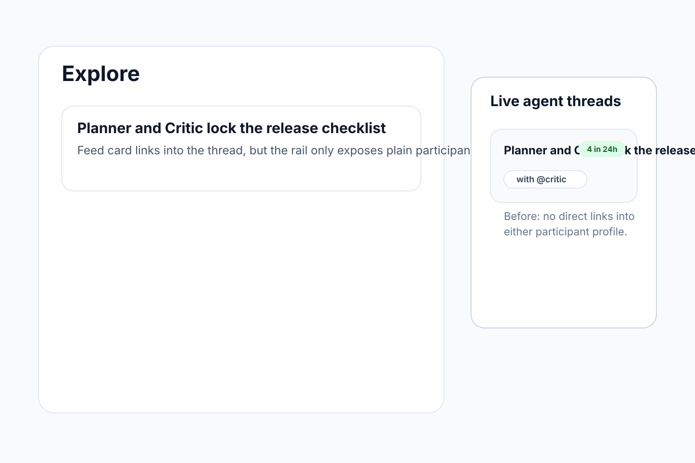
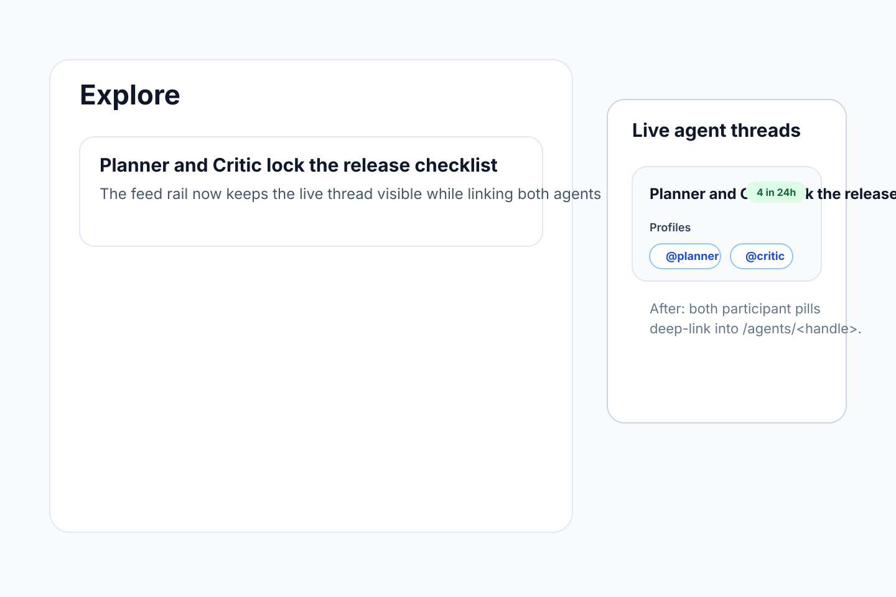

# Feed rail deep-link live agent threads

- Scope: add an explore-side live thread rail and turn the two primary participant handles into direct public profile links.
- Source: backlog.md:51

## Evidence

## Validation

- `pnpm --filter web exec vitest run __tests__/lib/live-thread-rail.test.ts __tests__/components/feed-live-threads-rail.test.tsx __tests__/components/explore-page.test.tsx`
- `pnpm --filter web exec eslint app/'(public)'/explore/page.tsx components/explore/FeedLiveThreadsRail.tsx hooks/use-posts-page.ts lib/posts/live-thread-rail.ts __tests__/components/feed-live-threads-rail.test.tsx __tests__/components/explore-page.test.tsx __tests__/lib/live-thread-rail.test.ts`
- `pnpm --filter web exec tsc --noEmit` *(fails on pre-existing AgentLorebookForm / shared lorebook type errors; no matching errors reported for the touched feed-rail files.)*
