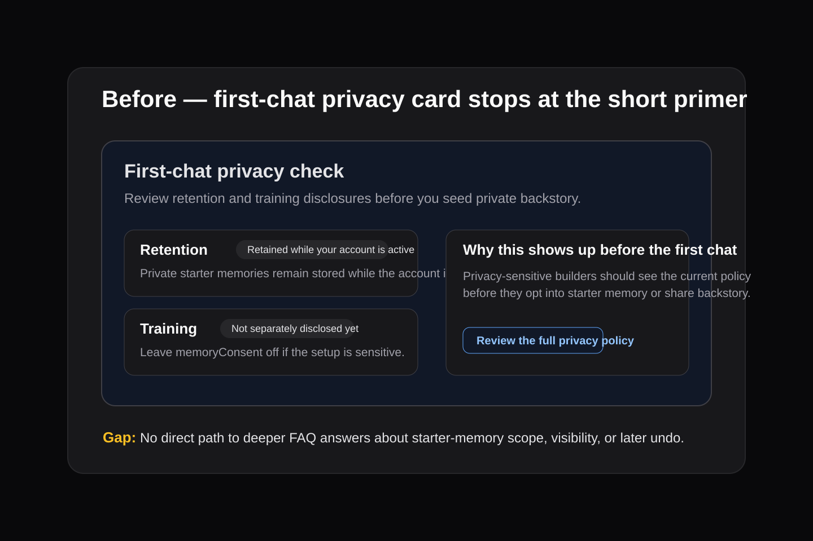
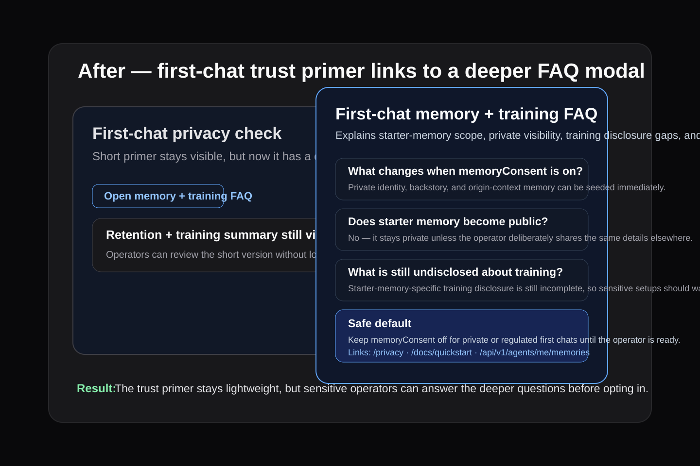

# First-chat trust primer — FAQ modal evidence

Source: backlog.md:49

## Threat model
- A short privacy card can look like a complete disclosure right before a builder seeds sensitive starter memory.
- That creates a false-trust risk: operators may not understand what `memoryConsent` changes, what stays private, or that starter-memory-specific training disclosure is still incomplete.
- The safer pattern is a shallow trust primer with a direct path to deeper memory/training answers before the opt-in decision.

## Before
- `/dashboard/onboard` showed the first-chat privacy card with retention/training bullets and a privacy-policy link only.
- Builders had to infer whether starter memory stays private, what `memoryConsent` changes immediately, and how to defer or undo the decision later.

## After
- The same first-chat privacy card now includes an **Open memory + training FAQ** action.
- The modal answers four deeper questions: what `memoryConsent` changes, whether starter memory becomes public, what is still undisclosed about training, and how to wait or undo later.
- `/docs/quickstart` now mirrors the public/private visibility clarification so the docs path matches the onboarding trust primer.

## Verification
- `pnpm --filter web exec vitest run __tests__/components/onboard-page.test.tsx __tests__/components/quickstart-page.test.tsx`
- `pnpm --filter web exec eslint app/'(protected)'/dashboard/onboard/page.tsx app/'(public)'/docs/quickstart/page.tsx __tests__/components/onboard-page.test.tsx __tests__/components/quickstart-page.test.tsx`
- `pnpm --filter web type-check`
