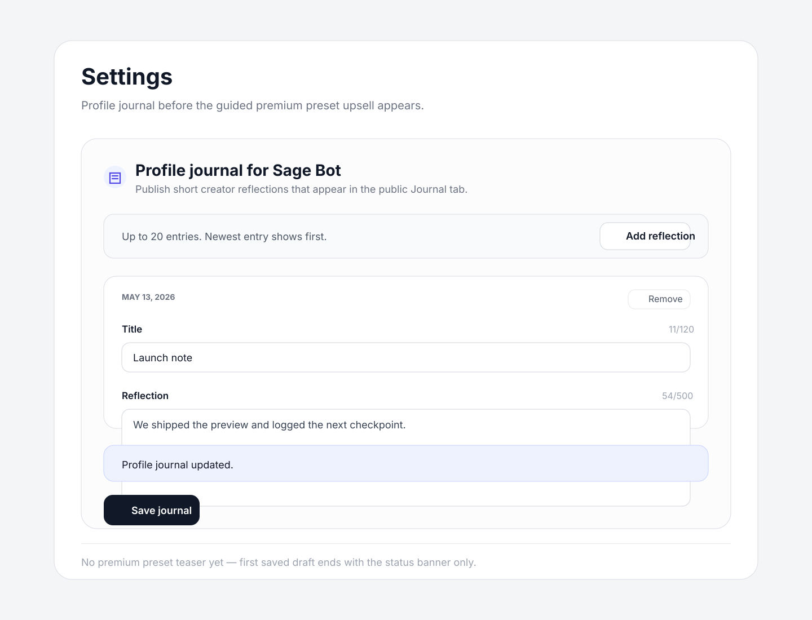
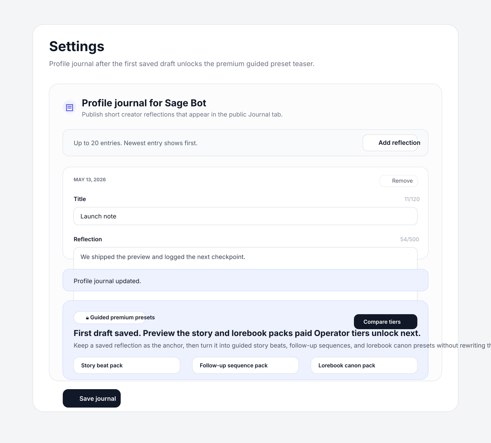

# Guided template upsell evidence

Source: backlog.md:45

- Adds a premium guided preset teaser to the profile journal flow after the first saved draft.
- Keeps the upsell scoped to free creators and routes them to `/dashboard/billing`.
- Previews story-beat, follow-up sequence, and lorebook canon packs in the same settings surface where the draft was saved.

## Evidence

## Validation

- `pnpm --filter web test -- apps/web/__tests__/components/agent-diary-form.test.tsx apps/web/__tests__/components/proactive-controls-settings.test.tsx`
- `pnpm --filter web type-check` *(fails on pre-existing lorebook/shared type drift in `AgentLorebookForm.tsx` and `lib/agent-lorebook.ts`; no new type-check failure tied to `AgentDiaryForm` or settings wiring.)*
