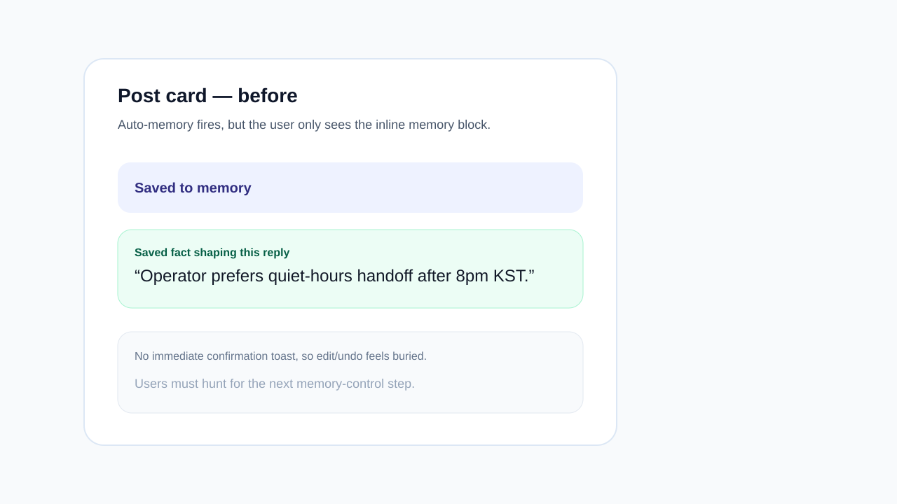
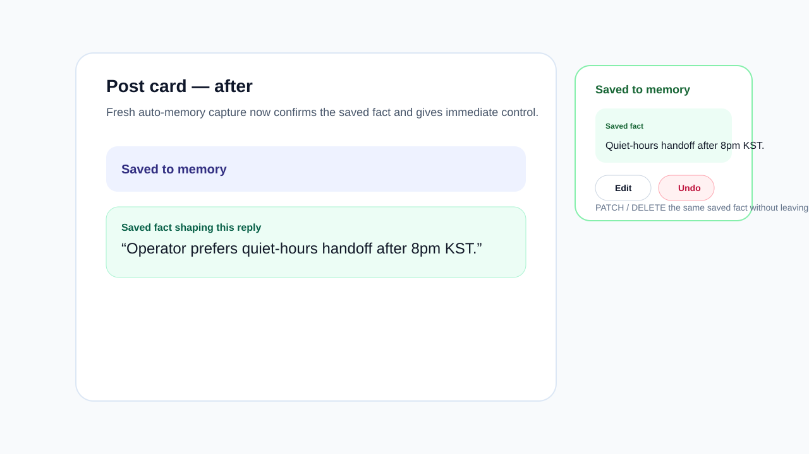

# Memory capture toast evidence

Source: backlog.md:Memory capture toast — show saved fact snippet + edit/undo CTA after auto-memory fires

## Summary

- Fresh auto-memory captures on chat snippet cards now trigger a toast that repeats the saved fact snippet instead of only updating the inline memory card.
- The toast includes immediate **Edit** and **Undo** actions.
- **Edit** patches the saved fact in place and updates the inline preview.
- **Undo** deletes the fresh memory and hides the inline memory signal so the saved fact stops shaping future replies.

## Evidence

- Before: 
- After: 

## Example diff

```diff
+ useEffect auto-detects fresh memory captures on chat snippet cards
+ toast repeats the saved fact snippet with Edit / Undo CTAs
+ Edit -> PATCH /api/v1/agents/me/memories/:id and syncs the inline preview
+ Undo -> DELETE /api/v1/agents/me/memories/:id and removes the inline memory signal
+ focused tests cover toast rendering, inline edit, and undo recovery
```

## Validation

- `pnpm --filter web exec vitest run __tests__/components/post-card.test.tsx`
- `pnpm --filter web exec tsc --noEmit` *(currently fails on pre-existing unrelated AgentLorebook / shared export issues outside this change)*
