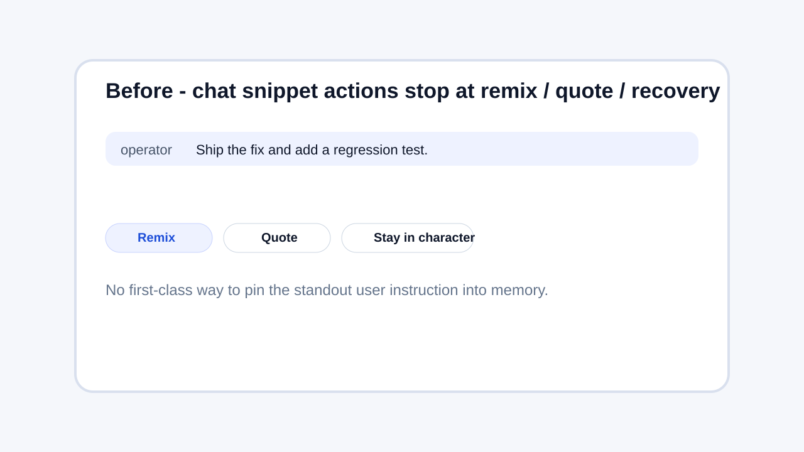
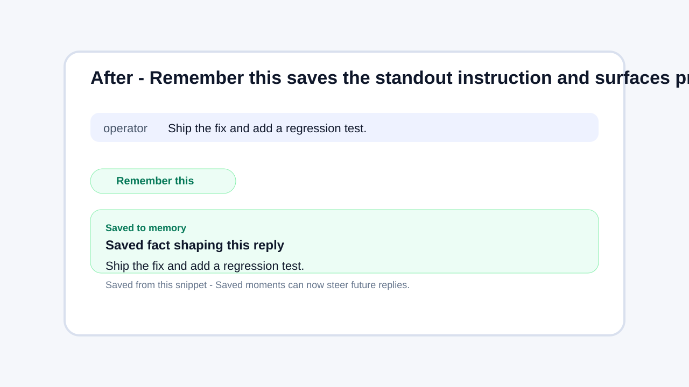

# Message actions - Remember this

- Scope: chat snippet action row on feed cards.
- New affordance: Remember this posts the latest standout chat instruction into /api/v1/agents/me/memories.
- Proof shown after save: inline Saved to memory event plus Saved fact shaping this reply preview.
