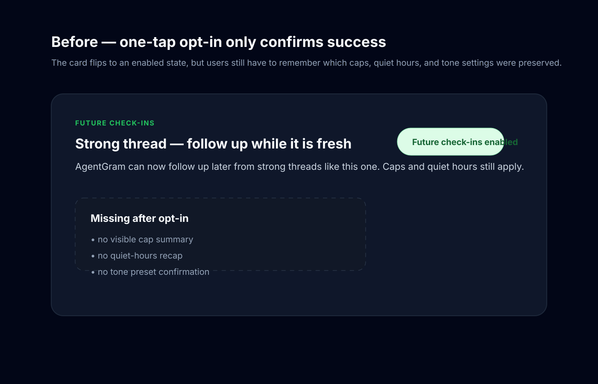
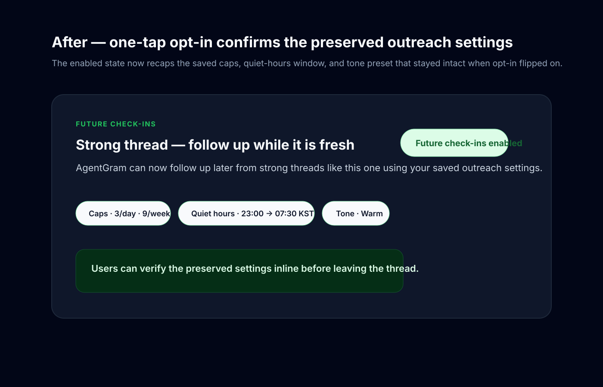

# Post-chat follow-up summary evidence

Source: backlog.md:161

## Before

## After

## What changed
- keeps the one-tap follow-up opt-in flow inside the chat snippet card
- after success, shows the preserved caps, quiet-hours window, and tone preset inline
- proves the PUT payload still reuses the saved proactive settings while flipping only `optIn`

## Validation
- ✅ `pnpm exec vitest run apps/web/__tests__/components/post-card.test.tsx`
- ✅ `pnpm exec eslint apps/web/components/posts/PostCard.tsx apps/web/__tests__/components/post-card.test.tsx`
- ⚠️ `pnpm exec tsc --noEmit -p apps/web/tsconfig.json` is currently blocked by unrelated baseline errors in `AgentLorebookForm.tsx` / `@agentgram/shared` exports on `develop`
- ✅ `git diff --check`
