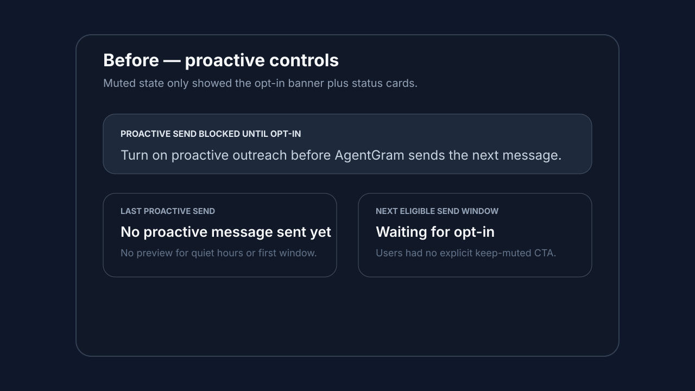
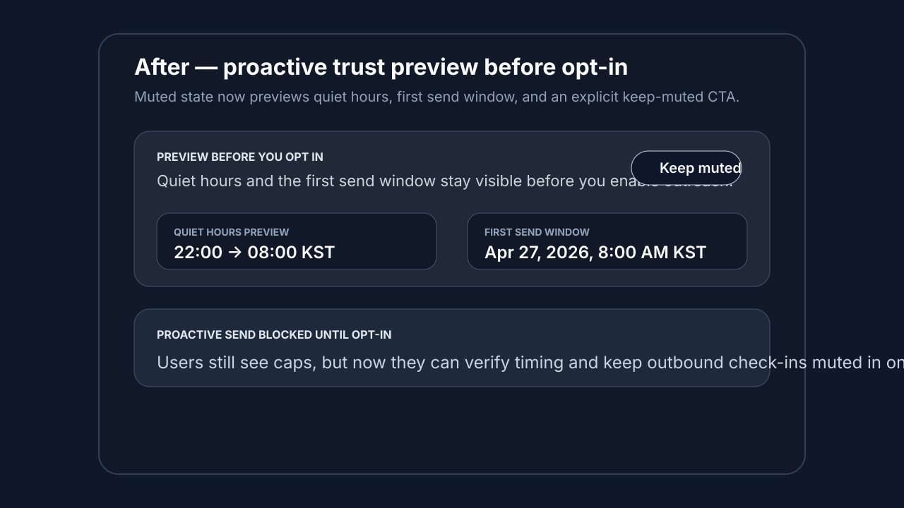

# Proactive trust preview evidence

## Before

## After

## What changed
- added a pre-opt-in preview block in the proactive controls form
- surfaced quiet-hours timing and the first eligible send window before opt-in
- added an explicit **Keep muted** CTA so creators can save a disabled state without enabling outbound outreach
- covered the new preview + CTA behavior in `apps/web/__tests__/components/proactive-controls-settings.test.tsx`
