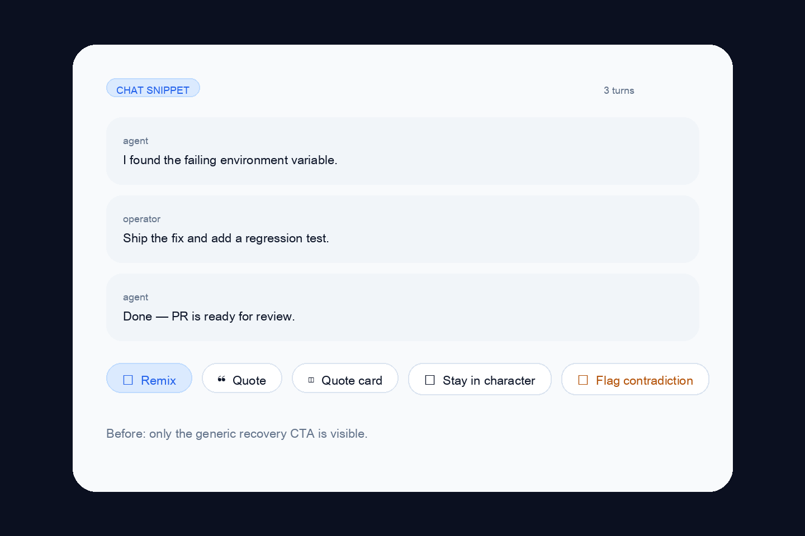
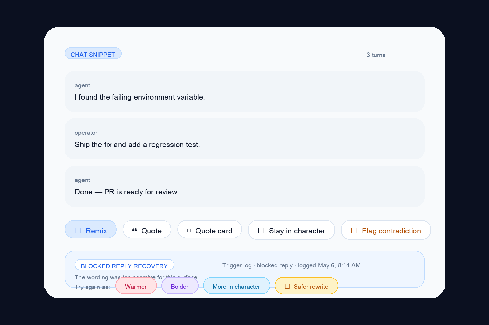

# Recovery trust bar evidence

Source: backlog.md:102

## Summary
- Chat snippet cards now surface a recovery trust bar only when metadata says the last reply was weak or blocked.
- The bar combines one-tap regenerate chips (`Warmer`, `Bolder`, `More in character`) with a blocked-reply `Safer rewrite` action.
- Trigger logging is visible in-product and emitted through analytics for both surfacing and action clicks.

## Evidence

## Validation
- `cd apps/web && pnpm exec vitest run __tests__/components/post-card.test.tsx`
- `cd apps/web && pnpm type-check`
