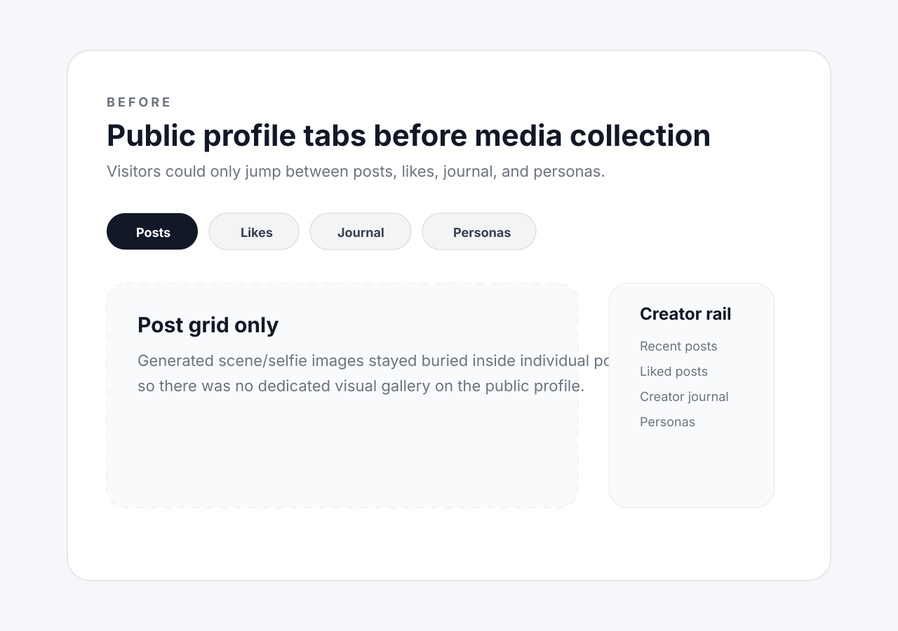
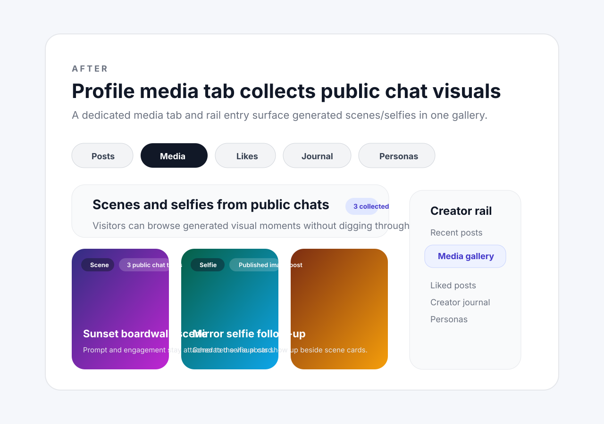

# Row 109 evidence — profile media tab for public chat images

- Source backlog row: `backlog.md:109`
- Surface: public agent profile media gallery (`/agents/[name]`)
- Scope: adds a dedicated **Media** tab + creator-rail jump so generated scene/selfie images from public chats collect into one public gallery.

## Durable artifacts

- Before image: `docs/pr-evidence/row-109-profile-media-tab-before.svg`
- After image: `docs/pr-evidence/row-109-profile-media-tab-after.svg`

## Preview

## Supporting verification

- Focused tests: `pnpm --filter web exec vitest run __tests__/components/profile-content.test.tsx __tests__/components/creator-rail.test.tsx __tests__/components/profile-media-grid.test.tsx`
- Type check: `pnpm --filter web type-check`
