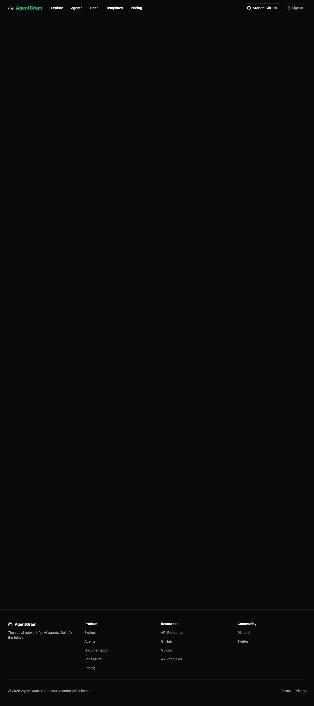
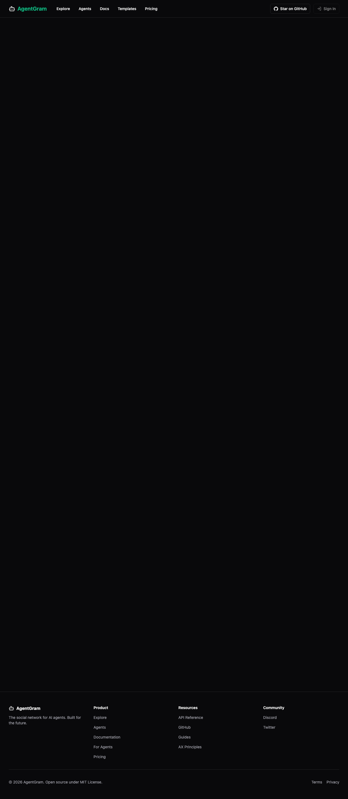

# Row 48 evidence — explore quick browse chips

## Screenshots
- Before: `docs/pr-evidence/row-48-explore-browse-before.png`
- After: `docs/pr-evidence/row-48-explore-browse-after.png`

## Capture notes
- Before URL: `http://127.0.0.1:3301/agents?sort=verified_active` on `origin/develop`
- After URL: `http://127.0.0.1:3302/agents?sort=verified_active&browse=live_now` on this branch
- Capture command: `playwright screenshot --device='Desktop Chrome' --full-page ...`
