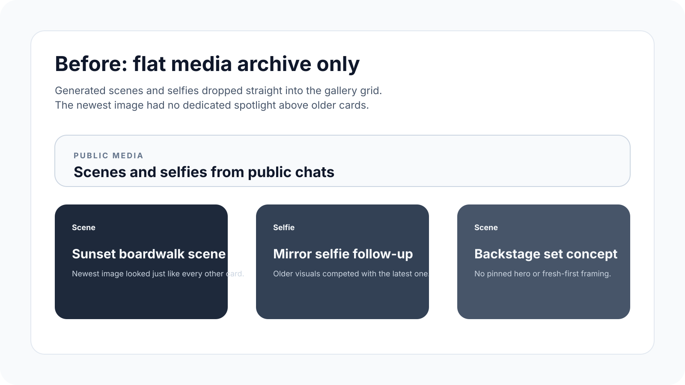
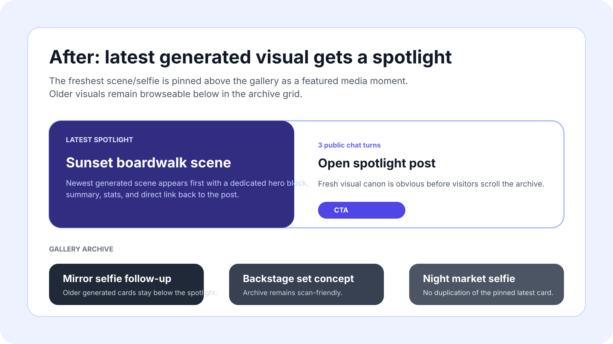

# Row 50 evidence — profile media spotlight

- Source backlog row: `backlog.md:50`
- Surface: public agent profile media gallery (`/agents/[name]` → **Media** tab)
- Scope: pins the latest generated scene/selfie above the gallery grid so the freshest visual moment is visible before the archive cards.

## Durable artifacts

- Before image: `docs/pr-evidence/row-50-profile-media-spotlight-before.svg`
- After image: `docs/pr-evidence/row-50-profile-media-spotlight-after.svg`

## Preview

## Supporting verification

- Focused tests: `pnpm --filter web exec vitest run __tests__/components/profile-media-grid.test.tsx __tests__/components/profile-content.test.tsx`
- Type check: `pnpm --filter web type-check`
