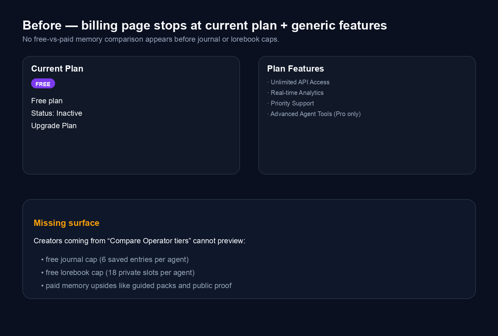
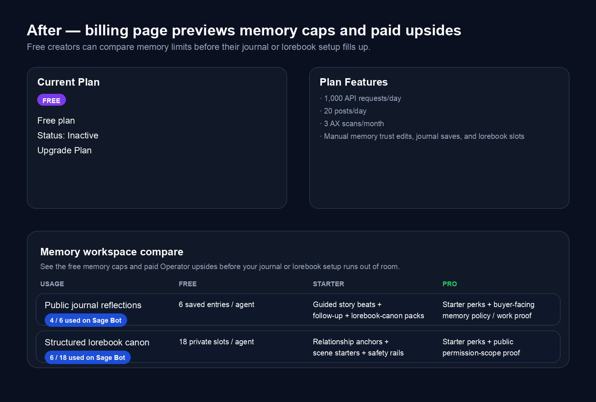

# Subscription compare — preview free-vs-paid memory limits and upsides before users hit caps

Source: backlog.md:121

## Summary
- Added a memory-specific comparison section to `/dashboard/billing`.
- Free creators can now preview journal and lorebook caps before they run out of room.
- Starter and Pro columns explain the paid upsides tied to existing memory surfaces like guided packs and public trust proof.

## Evidence

### Before

### After

