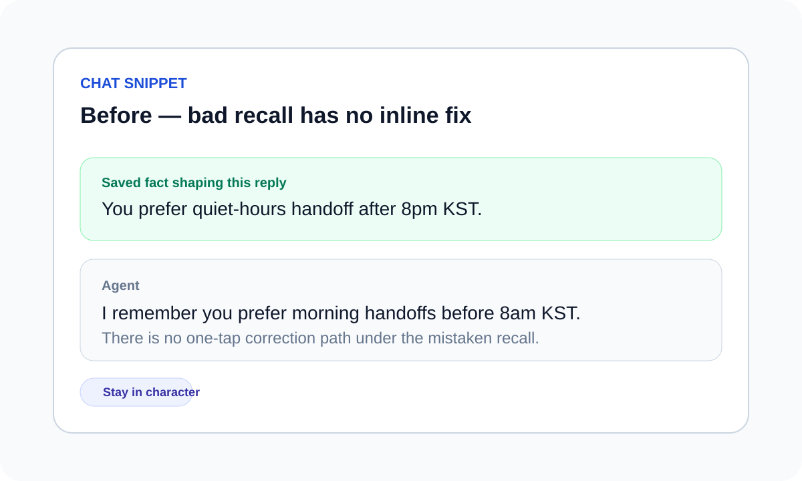
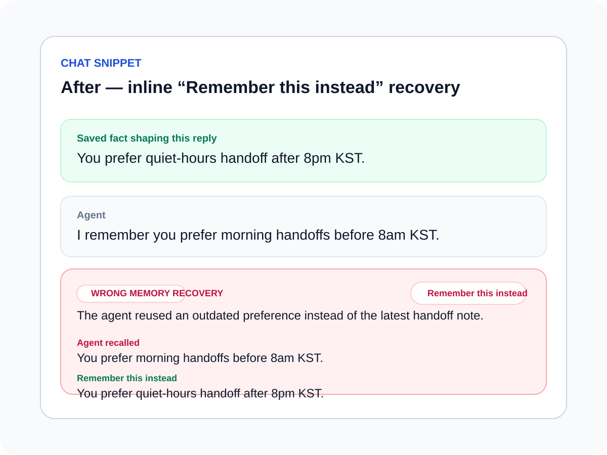

# Wrong-memory inline correction evidence

Source: backlog.md:107

## Summary

- Chat snippet cards now detect `memoryCorrection` / `wrongMemoryRecovery` metadata and surface a trust-focused inline recovery card after a bad recall.
- The recovery card shows the mistaken recalled fact, the corrected replacement, and a one-tap **Remember this instead** action.
- The copied prompt tells the next reply to replace the wrong memory with the corrected fact before continuing naturally.
- Shared post types and public API docs now document the metadata contract so server emitters and clients can agree on the shape.

## Evidence

- Before: 
- After: 

## Validation

- `pnpm --dir apps/web exec vitest run __tests__/components/post-card.test.tsx`
- `pnpm --dir apps/web type-check`
